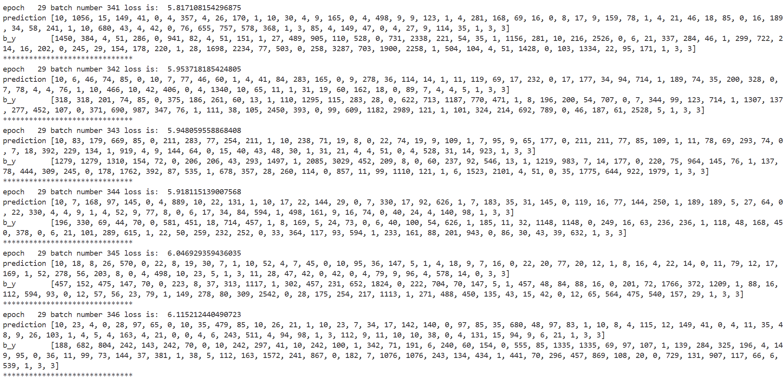
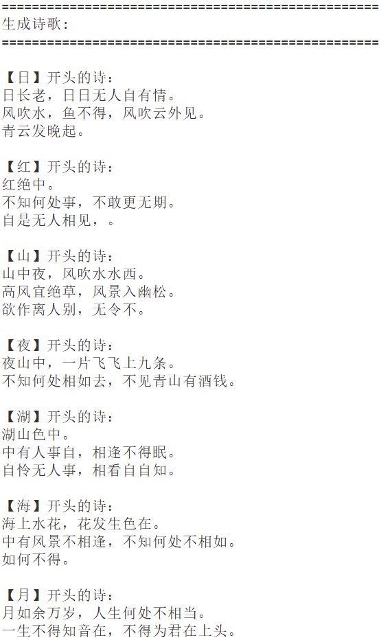

# 循环神经网络(RNN) 诗歌生成实验报告

## 一、 模型原理解释

### 1. RNN (Recurrent Neural Network, 循环神经网络)

RNN 是一种专门处理序列数据的神经网络架构。与传统的前馈神经网络不同，RNN在其隐藏层之间引入了定向循环连接，这使得它能够保留之前步骤的输入信息（即“记忆”）。在每一个时间步，网络会结合当前的输入数据和上一个时间步的隐藏状态来产生新的隐藏状态。虽然RNN理论上可以处理任意长度的序列，但在实际应用中，由于反向传播过程中梯度连乘导致的“梯度消失（Gradient Vanishing）”或“梯度爆炸（Gradient Exploding）”问题，标准RNN很难学习到长距离的依赖关系。

### 2. LSTM (Long Short-Term Memory, 长短期记忆网络)

为了解决标准RNN的梯度消失和长序列依赖问题，LSTM 引入了“细胞状态 (Cell State)”和三个具有控制作用的“门 (Gate)”机制（遗忘门、输入门、输出门）。

- **遗忘门**：决定从前一时刻的细胞状态中丢弃哪些无用的信息。
- **输入门**：决定哪些新信息会被添加到当前的细胞状态中，包含更新值的候选层。
- **输出门**：根据当前的细胞状态和输入，决定输出什么值作为当前时刻的隐藏状态。
这种复杂的内部结构让LSTM在训练过程中能够有效地控制信息的流动，能够更稳定地记住长前文的重要特征，在诗歌生成这种需要兼顾上下文的任务中表现极佳。

### 3. GRU (Gated Recurrent Unit, 门控循环单元)

GRU 是 LSTM 的一种轻量级变体。它将 LSTM 的遗忘门和输入门合并为一个“更新门 (Update Gate)”，同时引入了“重置门 (Reset Gate)”。

- **更新门**：控制前一时刻的状态信息被带入当前状态的程度，相当于整合了遗忘和记忆的功能。
- **重置门**：控制忽略前一时刻状态信息的程度。
相较于 LSTM，GRU 的模型结构更简单（只有两个门且没有单独的细胞状态），参数量更少，在保持相似性能的同时，其训练速度往往更快，更易于收敛，在很多序列建模任务上可以作为 LSTM 的直接替代网络。

---

## 二、 诗歌生成过程描述

本实验基于 LSTM 模型进行唐诗生成，整体过程主要包含以下几个阶段：

1. **数据预处理**：
   - 读取唐诗数据集（如 `poems.txt` 等格式化语料）。
   - 过滤掉包含特殊符号和长度不合规（如太短或太长）的异常诗句。
   - 在每首诗的开头加上起始符 `'G'`，在结尾加上终止符 `'E'`。
   - 统计所有的字符及其出现频率，构建字到索引 (`word_to_int`) 和索引到字 (`vocabularies`) 的词表映射关系，最终将每首诗转换为数字序列向量。

2. **模型构建与训练**：
   - 构建 `word_embedding` 词嵌入层，将离散的文字ID转换为低维稠密的向量表示以获取词意特征。
   - 搭建包含2层隐层的双向/单向 `LSTM` 结构，以及后续将隐状态映射回词表大小的全连接层(`Linear`)，并通过 `LogSoftmax` 输出各个词对应的概率分布。
   - 将格式化好的批次序列数据输入网络进行训练，使用 NLLLoss 作为损失函数，计算预测词和实际下一个词（Target）之间的误差，通过反向传播更新权重，并定时保存模型参数权重文件。

3. **模型推理与诗歌生成**：
   - 载入训练好的模型权重参数，将模型切换至评估模式 (`model.eval()`)。
   - 给定一个预设的起始字（例如“日”），将其转化为词向量后输入 LSTM 网络。
   - LSTM 网络输出下一步出现的候选词概率分布，选取概率最大的字（或依概率采样）的索引作为生成的下一个字。
   - 将新生成的字拼接到已生成的序列后，并将新生成的字作为输入再次喂给 LSTM 进行下一轮前向传播。如此循环迭代，直到模型预测出终止符 `E` 或序列长度达到规定的上限阈值，最终完成一整首诗歌的生成。

---

## 三、 本地实验生成截图

### 1. 训练阶段情况

> 以下截图中展示了模型在 PyTorch 环境下训练期间的 Loss 下降过程，以及目标标签（target）和模型预测标签（prediction）的对比列表。可以清楚地看到模型正在学习汉字的转移概率模型。

### 2. 诗歌生成结果

使用训练完毕的模型权值，代码中分别以 **“日”、“红”、“山”、“夜”、“湖”、“海”、“月”** 为开头字 (`begin_word`) 生成诗歌。程序通过自回归迭代不断给出下文。

> 以下为生成的各类指定开头的诗歌在终端的运行结果截图展示：

---

## 四、 实验总结

通过本次深度学习的 RNN 诗歌生成实验，我完整体验了利用循环神经网络处理自然语言生成任务的整体流程，并获得了诸多体会：

1. **加深了对序列建模及其变体的理解**：深刻认识了基本 RNN 难以处理长依赖问题（长期记忆衰退、梯度消失问题）的原因，理解了 LSTM 和 GRU 是如何通过巧妙的门控单元结构从本质上克服这类问题的发生，让网络更加关注长远上下文信息。
2. **巩固了 PyTorch 构建 NLP 模型的基本技能**：对于词嵌入层（Embedding）、多层 LSTM（`batch_first=True` 设定和记忆状态维度的控制）、全连接维度的对齐，以及在测试阶段调用 `eval()` 防止 dropout 干扰等框架实践内容更加熟悉。
3. **加深了对自然语言自回归生成的感悟**：体会了在自回归任务里（即下一个 token 预测），如何使用滑动窗口或是逐字接续的方式利用历史输入来迭代生成完整的长句。这也使我明白了自然语言为何有着数学上分布的概率性质，感受到了模型参数与数据拟合之间的魔法联系。

整体而言，本次实验在验证所学理论的基础上，动手实现了一个非常有趣且具体的落地应用场景，锻炼了自己针对错误调试的功底，达成了本次实验的既定目标。
