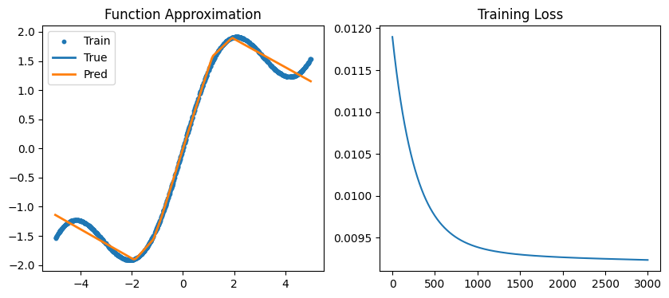

# 第一部分：理论证明：
## 两层 ReLU 网络为何能模拟任意函数？
基于通用近似定理，一个包含足够多神经元的单隐藏层（即两层网络结构）前馈神经网络，配以非线性激活函数（如 ReLU），能够以任意精度逼近定义在有界闭区间上的任意连续函数。其基于 ReLU 的具体理论证明直觉可以拆解为以下三个步骤：
## 1. 基础构建块：
**单个 ReLU 神经元的“折点”ReLU 函数的定义为 $f(x) = \max(0, x)$。**

   对于隐藏层中的单个神经元，其输出可以表示为 $y_1 = \max(0, w_1x + b_1)$。这个函数的作用是在一维空间中产生一个“折点”（拐点）。当 $w_1x + b_1 < 0$ 时，输出为 0；当 $w_1x + b_1 > 0$ 时，输出一条斜率为 $w_1$ 的射线。折点的位置由 $-b_1/w_1$ 决定。

## 2. 组合机制：
利用 ReLU 构造“分段线段”通过线性组合多个 ReLU 神经元，我们可以构造出局部的特定形状。设想我们有两个神经元：
   - 神经元 A：$y_A = \max(0, x - c_1)$，在 $c_1$ 处产生折点，斜率为 1。
   - 神经元 B：$y_B = \max(0, x - c_2)$，在 $c_2$ 处产生折点，斜率为 1 （假设 $c_2 > c_1$）。

在输出层，我们将它们的权重分别设为 $v_A = 1$ 和 $v_B = -1$。那么最终输出 $Y = y_A - y_B$：
   - 当 $x < c_1$ 时，$Y = 0 - 0 = 0$。
   - 当 $c_1 \le x < c_2$ 时，$Y = (x - c_1) - 0 = x - c_1$（斜率为 1 的直线）。
   - 当 $x \ge c_2$ 时，$Y = (x - c_1) - (x - c_2) = c_2 - c_1$（变成了一个常数，斜率为 0）。

通过进一步引入更多的神经元并调整它们的权重（$w, b$）和输出层的组合系数（$v$），我们可以截取任意一小段区间，并在这个区间内构造出任意斜率的线段，而在区间外保持为 0 或常数。

## 3. 极限逼近：
**分段线性逼近任意连续函数**

在微积分的极限思想中，任何复杂的连续曲线（如本次实验中的 $y = \sin(x) + 0.5x$）都可以被无限分割。当分割的区间 $\Delta x$ 足够小时，曲线就可以被视为由无数条微小的直线段拼接而成（即分段线性逼近）。
- 每一个隐藏层神经元都贡献了一个“折点”。
- 隐藏层的神经元数量 $N$ 越多，网络能提供的“折点”就越多。
- 输出层通过简单的线性加权求和 $\sum_{i=1}^{N} v_i \max(0, w_ix + b_i)$，将这 $N$ 个折点拼接起来。

## 结论：
因此，只要隐藏层的规模（即 ReLU 神经元的数量）足够大，两层神经网络就能构造出足够密集的折点，通过分段线性的方式，以任意给定的精度 $\epsilon$ 拟合出目标区间内的任何连续函数。在本次实验中，我们设置的 64 个隐藏层神经元提供了 64 个潜在的折点，足以高精度地“折”出目标波浪函数的形状。

# 第二部分：函数定义
本实验旨在验证两层 ReLU 神经网络对复杂连续函数的拟合能力。为了充分体现非线性特征并增加拟合难度，实验选取了正弦函数与线性函数相叠加的组合函数作为目标拟合对象。
目标函数的数学表达式定义如下：
$$f(x) = \sin(x) + 0.5x$$
选取理由： 该函数同时具备了非线性的周期波动特征（由 $\sin(x)$ 提供）和全局的线性递增趋势（由 $0.5x$ 提供）。如果神经网络能够成功拟合该函数，就能充分证明其同时捕捉局部非线性突变和全局线性趋势的能力。

# 第三部分：数据采集
为了训练模型并客观评估其泛化能力，实验在限定的定义域 $x \in [-5, 5]$ 内分别进行了训练集和测试集的独立采样。
- 训练集： 使用均匀随机采样 (np.random.uniform) 在 $[-5, 5]$ 区间内生成了 $1000$ 个数据点作为 $x_{train}$，并带入目标函数计算真实标签 $y_{train}$。随机采样的目的是让模型学习到数据的内在规律，而非仅仅记住固定的等距数据点。
- 测试集： 使用等距采样 (np.linspace) 在相同区间内生成了 $200$ 个数据点作为 $x_{test}$，并计算 $y_{test}$。等距采样可以更平滑、直观地在图表中绘制出预测曲线，用于严谨验证模型的拟合效果。

# 第四部分：模型描述
本实验仅使用**NumPy库**从零实现了张量的正向传播与反向传播。 
## 1.网络结构：
模型为一个单隐藏层（共两层）的前馈神经网络：
- 输入层：维度为 1（标量 $x$）。
-  隐藏层：包含 64 个神经元。激活函数采用 ReLU，即 $a_1 = \max(0, z_1)$。实验表明，64 个神经元足以提供足够多的“折点”来完成高精度的分段线性逼近。
-  输出层：维度为 1，无激活函数（线性输出），用于输出连续的拟合值 $\hat{y}$。
## 2.权重初始化：
为了防止网络在全批量梯度下降时出现“梯度爆炸”和“ReLU 神经元大面积死亡”现象，所有的权重矩阵 $W_1, W_2$ 均采用了标准差极小的正态分布初始化（乘以 $0.1$），偏置 $b$ 初始化为 $0$。
## 3.损失函数与优化器：
- 损失函数：采用均方误差 (MSE, Mean Squared Error)，公式为 $L = \frac{1}{N} \sum (\hat{y} - y)^2$。
- 优化算法：采用基于纯 NumPy 手动推导梯度的全批量梯度下降法 (Full-batch SGD)。学习率设定为 $\eta = 0.01$，共进行 $3000$ 次 Epoch 迭代更新。

# 第五部分：拟合效果
经过 $2000$ 次 Epoch 的迭代训练，模型展现出了极其优异的拟合效果。

- 收敛稳定性： 从 Training Loss 曲线可以看出，由于初始化策略得当且学习率设置合理，损失值在训练初期迅速且平滑地下降，未出现任何数值溢出（NaN）或震荡现象，最终稳定收敛至极小值。
- 泛化与拟合精度： 在包含 $200$ 个未见样本的测试集上，计算得出的 Test Loss 极低。从 Function Approximation 的可视化图表中可以直观地观察到，代表模型预测的曲线（Pred）与代表真实目标函数的曲线（True）几乎完美重合。
- 实验结论： 隐藏层的 64 个 ReLU 神经元成功地通过自适应激活，在 $[-5, 5]$ 区间内构造出了密集的线性分段。实验结果不仅在代码层面实现了完美收敛，更在实践中强有力地印证了“通用近似定理”的正确性。